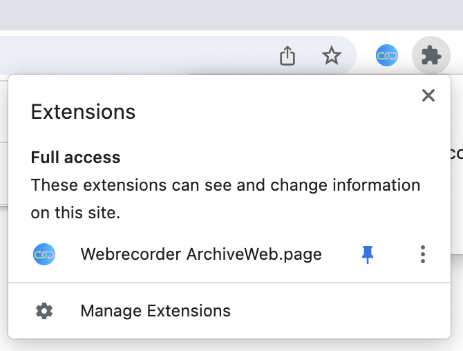
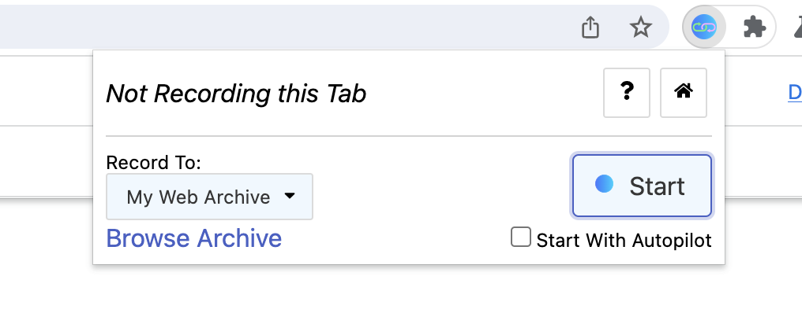

# NYU NewClasses Web Archiver

newclasses.nyu.edu is going away August 15th, and with it all the course
material posted there will be gone. In the same spirit of
[my Resources tab data archiver](https://github.com/FrederickGeek8/nyuclasses-resource-scraper)
this repository allows you to archive the web data from NYU Classes.

This project runs inside of an isolated Chrome program. It uses the
[the ArchiveWeb.page Chrome extension](https://archiveweb.page/) to create a
copy of the pages that the browser visits. We use the automation tool `puppeteer`
to navigate around the NYU Classes and save a copy of all the pages.

**Currently Supported Page Saving**

1. Announcements
2. Syllabus
3. Assignments & Attachments

If there is another section of the webpage you would liked archived, please
open a support ticket or submit a pull request.

**Please read Limitations, Setup/First Run, and Usage before starting.**

This will take a long time. Please plug in your computer if you are using a laptop and ensure that it does not go to sleep.

## Setup/First Run

Once you have cloned the repo and have run `cd` into the project directory,
run `npm install` to install the dependencies neccessary for running the archiver.

In general, you can use `npm start` to compile the program and launch it.
**On your first run** you will have to install [the ArchiveWeb.page Chrome extension](https://archiveweb.page/)

## Usage

Once you have run `npm install` in this project, you can run

```bash
npm start
```

to compile and launch the web browser.

After the program launches, you will likely be greeted with the Shibboleth NYU
login screen. At this point the Terminal will read "Press Enter to Continue".
First, you need to login to your NYU account so you can get access to NYU Classes.

**Important!**

Once you have logged into your NYU account, activate [the ArchiveWeb.page Chrome extension](https://archiveweb.page/)
you installed in the **Setup/First Run** section. You can find this in your menu
bar, perhaps under the puzzle piece icon.



**Click the extension icon and press the "Start" button to start archiving the visited webpages**.


Then once you've started recording in the
[the ArchiveWeb.page Chrome extension](https://archiveweb.page/) in your menu
bar, the `Enter` key on your keyboard in the Terminal to start the archiving.

One of the first things you'll see in your Terminal when you start archiving is
a **list of all of the links to the classes you are a member of**. If your
archiver get's interrupted for any reason, you can copy from this list the
sites that have already been scraped into the `IGNORED_SITES` variable in
`index.ts`.

If the circumstances that you canceled your web archiving and would like to
archive more, please see the **Troubleshooting** section.

## Saving your web archive for use outside the browser

Now that hopefully your archiving has completed, you can access the archive
of NYU Classes by clicking the extension again. And hitting "Browse Archive":


From there you should be able to see your web archive, probably called
"My Web Archive". You can click the Download icon to download a `.warcz` archive
which contains the data of all the websites you scraped. This is a common format
that can be read by several tools, including
[ReplayWeb.page](https://webrecorder.net/tools#replaywebpage) which is made by
the same authors.

If the circumstances that you canceled your web archiving and would like to
archive more, please see the **Troubleshooting** section.

## Limitations

1. In addition to the incomplete nature of our archiving
   (see **Currently Supported Page Saving**) we don't fetch all the pages on NYU
   Classes. In order to scrape additional pages, we would have to build support
   into the code. This can be requested through a issue ticket here or a pull request.

2. When saving certain types of attachments from the **Assignments** page, if
   they are not a common web file type (e.g. `.docx`, `.zip`, `.c`), they will
   be automatically downloaded to your default Downloads folder on your computer.

## Troubleshooting

**Q:** I completed archiving the website but I restarted my computer and the
Chrome extension is no longer in the program. Is my archive gone?

**A:** Luckily, no it isn't. You should be able to reinstall [the ArchiveWeb.page Chrome extension](https://archiveweb.page/)
and your data should still be there.

---

**Q:** Part way through archiving the website, my program got cancled. How can
I resume the archiving without redoing everything that was scraped before?

**A:** You can click into your "My Web Archive" and sort the URLs by **Date**.
There you can see the URLs that were scraped most recently. Remember from
**Usage** that

> One of the first things you'll see in your Terminal when you start archiving is
> a **list of all of the links to the classes you are a member of**. If your
> archiver get's interrupted for any reason, you can copy from this list the
> sites that have already been scraped into the `IGNORED_SITES` variable in
> `index.ts`.

The program scrapes the websites in that list in order, so you know that the
last scraped URL is the first website you need to possibly redo, and the
subsequent ones also need to be grabbed.

What you can do now is copy the list of URLs that was output by the program
(or rerun it to get a new list) and add **the URLs before or on the last scraped URL**
to `IGNORED_SITES` in `index.ts`.

So if my program output

```javascript
[
    "http://url1",
    "http://url2",
    "http://url3",
    "http://url4"
];
```

and I know the last URL I was archiving was `url3`, then I could replace

```javascript
const IGNORED_SITES = [];
```

with

```javascript
const IGNORED_SITES = [
    "http://url1",
    "http://url2"
];
```

to scrape only `url3` and `url4`.
